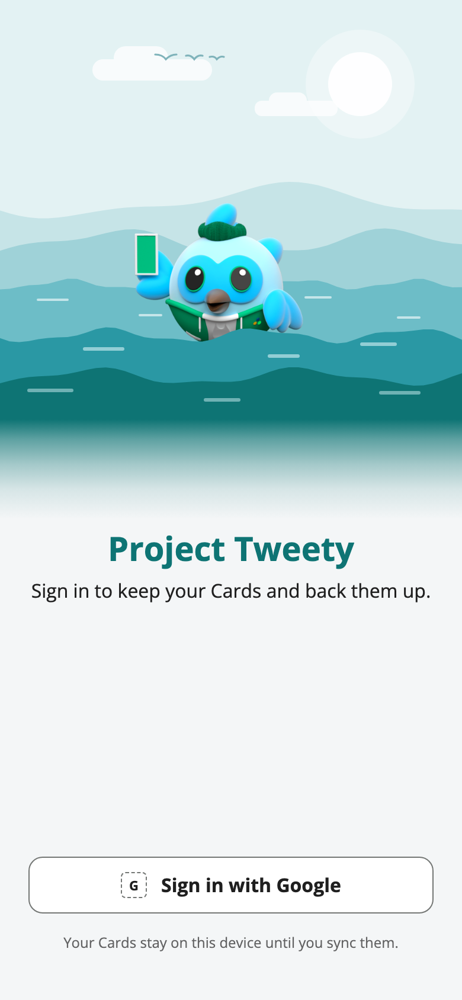

# Project Tweety

[](pubspec.yaml)
[](https://github.com/EuanScott/project-tweety/actions/workflows/ci.yml)
[](https://scorecard.dev/viewer/?uri=github.com/EuanScott/project-tweety)

A playground project to try out some ideas and work on some blockers that I face in my day job. I'm not really building
anything to serve a purpose here.

<p>
  
  &nbsp;&nbsp;
  
</p>

<p><sub>Sign-in screen design, light and dark. See the <a href="docs/design/visual_style.md">visual style guide</a>.</sub></p>

## Development Style

Historically, I've always used [Git FLow](https://www.gitkraken.com/learn/git/git-flow), specifically at work. However,
as this is a playground project, I will be using [Trunk Based Development](https://trunkbaseddevelopment.com/).

## Setup & Usage

Nothing fancy here, I'm just following the "Get started" guide on
the [Official Flutter Docs](https://docs.flutter.dev/get-started/install)

This project requires Flutter `3.47.0` (Dart `3.13.0`). After installing dependencies, enable the repo's git hooks once
per clone:

```sh
git config core.hooksPath .githooks
```

Then use the following validation loop:

```sh
dart format --output=none --set-exit-if-changed .
flutter analyze --no-fatal-infos
tool/hooks/bloc_lint.sh lib test packages
dart run tool/agent_context/validate.dart
dart run tool/skills/validate.dart
dart run tool/decisions/adr.dart check
flutter test
```

Run one test file with:

```sh
flutter test test/path_test.dart
```

CI runs the same checks, except formatting, and fails on any analysis or bloc warning or error. Infos never fail a
build. The rationale is [ADR-0010](docs/decisions/0010-pre-commit-analysis-and-ci-enforcement.md).

Native Android and iOS coverage remains an explicit device/simulator check:

```sh
flutter test integration_test/cards_sqlite_smoke.flow_test.dart -d <device-id>
```

See [the testing guide](docs/testing/README.md) for what belongs in `test/`,
`integration_test/`, and `test_driver/`.

### Pre-commit hook

`.githooks/pre-commit` runs the three agent-tooling validators on every commit:

```sh
dart run tool/agent_context/validate.dart
dart run tool/skills/validate.dart
dart run tool/decisions/adr.dart check
```

These guard `AGENTS.md` line budgets, Markdown link integrity, skill word budgets, and ADR structure.

When the commit stages Dart files, the hook then runs `flutter analyze --no-fatal-infos` and
`tool/hooks/bloc_lint.sh` on those files only. Warnings and errors block the commit; infos are printed but do not.
`bloc lint` applies the `bloc:` rules in `analysis_options.yaml`, which `flutter analyze` ignores. `bloc_tools` is a
pinned development dependency, so `flutter pub get` installs it.

Bypass with `git commit --no-verify`. CI runs the same checks on the whole project, so a bypassed hook still fails the
build.

Three caveats. The hook reads the working tree rather than the index, so a partially staged file is checked as it is on
disk, not as it is being committed. It does not report problems in unstaged files that a staged change breaks; CI does.
And the hook needs `dart` and `flutter` on `PATH`, which a GUI git client may not provide.

### Versioning

`pubspec.yaml` is the version of record, and it is maintained by the commit message rather than by hand.
`.githooks/post-commit` reads the Conventional Commit type and amends the commit with the matching bump:

| Commit type                                                      | Bump                                           |
|------------------------------------------------------------------|------------------------------------------------|
| `feat`, `feature`                                                | minor                                          |
| `fix`, `perf`                                                    | patch                                          |
| `!` marker or `BREAKING CHANGE:` footer                          | minor while the major is `0`, otherwise major. |
| everything else (`chore`, `docs`, `refactor`, `test`, `ci`, ...) | none                                           |

Two things follow from the amending. The commit hash printed by `git commit` is stale, so read `git log -1` before
quoting
one. And `--no-verify` does not skip this hook — git does not pass that flag to `post-commit`. Use
`NO_VERSION_BUMP=1 git commit ...` instead. A version edited by hand in the same commit is never re-bumped, which is how
`1.0.0` and any deliberate correction get set.

The version badge at the top of this file reads `pubspec.yaml` from `main`, so it follows a push with no separate
release step.

The rationale, including why `pre-commit` and `commit-msg` cannot do this,
is [ADR-0009](docs/decisions/0009-conventional-commit-driven-versioning.md). The mapping itself lives in
`tool/hooks/bump_version.sh`.

## Security

### Vulnerability scanning

The [Security workflow](.github/workflows/security.yml) runs [OSV-Scanner](https://google.github.io/osv-scanner/). It
runs on every push to `main`, on every pull request, and every Monday. It compares each `pubspec.lock` and the iOS
Swift package lockfiles with the Open Source Vulnerabilities ([OSV](https://osv.dev/)) database. The weekly run finds
vulnerabilities that are published after the code last changed. Results go to the repository Security tab.

The scan does not cover Android Gradle dependencies. OSV-Scanner reads only Gradle lockfiles, and the Android build has
none.

### Dependency updates

[Dependabot](.github/dependabot.yml) proposes updates every week for pub (the app and both packages), Gradle and GitHub
Actions. Dependabot waits 7 days after a version is published. A compromised release is usually found and removed in
that time.

Each workflow action is pinned to an exact commit, not to a version tag. A tag can be moved to different code; a commit
cannot. Each workflow gives its GitHub token read access only, and adds write access only where a job needs it.

### OpenSSF Scorecard

The Open Source Security Foundation (OpenSSF) Scorecard badge grades how the project is run. It checks practices such
as pinned dependencies, token permissions, a security policy and dependency updates. The expected score is about 6 to 7
out of 10.

Two checks score low on purpose:

- **Code-Review** scores 0. It counts changes that a second person approved in a pull request.
- **Branch-Protection** scores low. It wants `main` to require pull requests and reviews.

This project has one maintainer, who pushes directly to `main` (see [Development Style](#development-style)). A pull
request with no second reviewer adds work but no review. The project accepts the lower score.

To report a vulnerability, see [SECURITY.md](SECURITY.md).

## Project Docs

Broader project guides live under `docs/`. Current guides include:

- [Navigation, deep links, and route guards](docs/testing/navigation.md)
- [Cards SQLite persistence and native smoke testing](docs/architecture/cards_sqlite_foundation.md)
- [Architecture Decision Records](docs/decisions/README.md)
- [Conventional-commit-driven versioning](docs/decisions/0009-conventional-commit-driven-versioning.md)

## API Documentation

This project uses Dart doc comments for generated API documentation.

To generate the docs locally:

```sh
dart doc --output doc/api
```

Then open the generated docs:

```sh
open doc/api/index.html
```

The generated `doc/api/` output is ignored by git.
